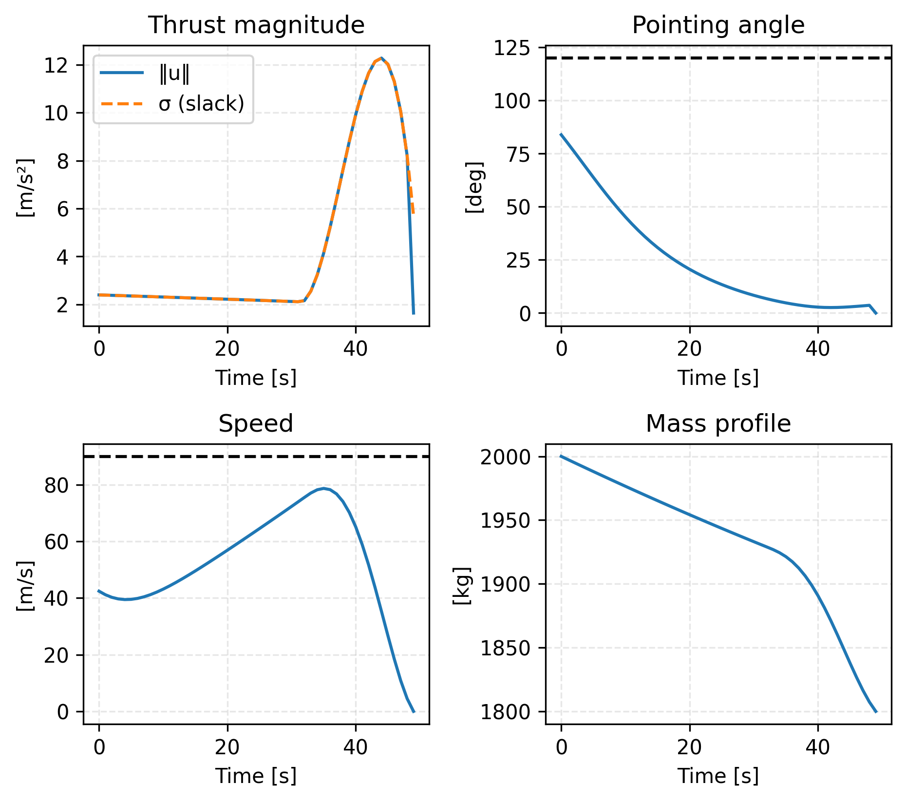
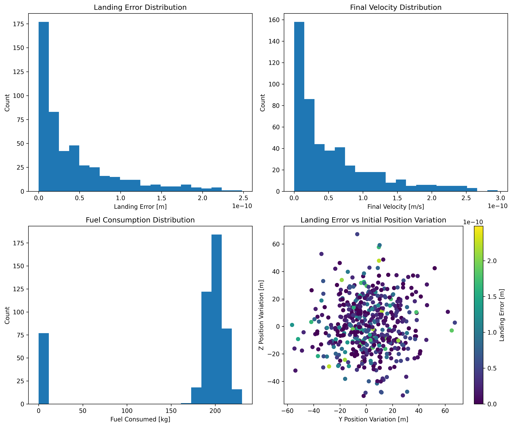

# Lossless Convexification Powered Descent Guidance (LCVX-PDG)


*Low-fidelity animation of the powered-descent trajectory produced by the minimum-error guidance solution.  The plume length/color vary with instantaneous thrust, and the vehicle model is fully 3-D.*

This repository implements the Lossless Convexification approach for the Soft Landing Optimal Control Problem as described in the paper:

> Behçet Açıkmeşe, John M. Carson III, and Lars Blackmore, "Lossless Convexification of Nonconvex Control Bound and Pointing Constraints of the Soft Landing Optimal Control Problem," IEEE Transactions on Control Systems Technology, vol. 21, no. 6, pp. 2104-2113, Nov. 2013.

## Overview

The project implements a convex optimization-based solution for the powered descent guidance problem, which is crucial for autonomous landing of spacecraft. The implementation solves two main problems:

1. **Minimum Landing Error Problem**: Finds the trajectory that minimizes the landing error while satisfying all constraints.
2. **Minimum Fuel Problem**: Given a maximum allowable landing error, finds the trajectory that minimizes fuel consumption.

The solution uses lossless convexification to handle nonconvex control constraints and pointing constraints, transforming them into convex optimization problems that can be solved efficiently.

## Features

- Implementation of the lossless convexification approach
- Solution of both minimum landing error and minimum fuel problems
- Visualization of trajectories, control inputs, and constraints
- Configurable system parameters for different scenarios

## Installation

1. Clone this repository:
```bash
git clone https://github.com/Natsoulas/lcvx-pdg.git
cd lcvx-pdg
```

2. Install the required dependencies:
```bash
pip install -r requirements.txt
```

## Usage

To run the example problem:

```bash
python main.py
```

This will:
1. Solve the minimum landing error problem
2. Calculate the maximum allowable landing error
3. Solve the minimum fuel problem
4. Generate plots of the results

The plots will be saved in the `figs` directory and include:
- Trajectory visualization
- Control input profiles
- Constraint satisfaction plots
- State variable evolution

## Project Structure

- `main.py`: Main script that sets up and solves the problems
- `src/`
  - `solver.py`: Implementation of the powered descent guidance solver
  - `system_parameters.py`: System parameter definitions
  - `plotting.py`: Visualization functions
- `figs/`: Directory containing generated plots
- `requirements.txt`: Python package dependencies

## Example Results

### Detailed 3D Trajectory with Constraints

*Detailed visualization showing the spacecraft's trajectory with glide-slope cone and thrust pointing constraints*

### Ground Track

*Ground track showing the YZ-plane projection of the trajectory*

### Time Histories

*Time histories of key variables including thrust magnitude, pointing angle, speed, and mass*

### Monte-Carlo Robustness Analysis

*Distributions of landing error, final velocity, and fuel consumption obtained from 500 randomly-dispersed simulations.  These results highlight the guidance algorithm's robustness to initial-state and parameter uncertainty.*

## License

This project is licensed under the MIT License - see the [LICENSE](LICENSE) file for details.

## Citation

If you use this code in your research, please cite the original paper:

```bibtex
@article{acikmese2013lossless,
  title={Lossless convexification of nonconvex control bound and pointing constraints of the soft landing optimal control problem},
  author={Açıkmeşe, Behçet and Carson, John M and Blackmore, Lars},
  journal={IEEE Transactions on Control Systems Technology},
  volume={21},
  number={6},
  pages={2104--2113},
  year={2013},
  publisher={IEEE}
}
```
